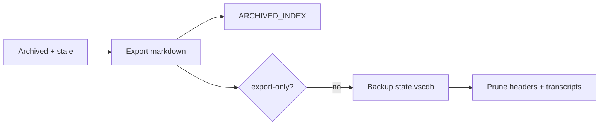

# Clear archived Cursor chats (7 / 30 day retention)

## When to use

- Operator asks to **clean archived chats**, **declutter Cursor**, or **rotate chat history**
- Scheduled hygiene (weekly **7** days, monthly **30** days)
- After confirming exports live in **`CURSOR_TODO`** or a git journal (private **my-cursor-config**)

## Retention

| Flag | Use |
|------|-----|
| `--days 7` | Aggressive — archived chats idle **≥ 7 days** |
| `--days 30` | Default — archived chats idle **≥ 30 days** |

Age is based on **`lastUpdatedAt`** (fallback `createdAt`). Only composers with **`isArchived: true`** are eligible.

## Script (this repo)

```bash
# Preview (30-day default)
python3 platform/macos-platform-agent/scripts/clear-archived-cursor-chats.py --dry-run

# Weekly-style
python3 platform/macos-platform-agent/scripts/clear-archived-cursor-chats.py --days 7

# Monthly-style (default)
python3 platform/macos-platform-agent/scripts/clear-archived-cursor-chats.py --days 30

# One workspace only (home folder example)
python3 platform/macos-platform-agent/scripts/clear-archived-cursor-chats.py --days 30 \
  --workspace-path "$HOME"

# Export only — do not delete from Cursor yet
python3 platform/macos-platform-agent/scripts/clear-archived-cursor-chats.py --days 7 --export-only
```

Run from **cursor-agents** repo root, or pass the full script path.

## Defaults (override with flags)

| Setting | Default |
|---------|---------|
| Cursor DB (macOS) | `~/Library/Application Support/Cursor/User/globalStorage/state.vscdb` |
| Cursor DB (Linux) | `~/.config/Cursor/User/globalStorage/state.vscdb` |
| Export dir | `~/AiChats/CURSOR_TODO/archived/` |
| Index append | `~/AiChats/CURSOR_TODO/ARCHIVED_INDEX.md` |
| DB backup | `platform/macos-platform-agent/scripts/.backups/` (skip with `--no-backup`) |

## Safety

1. **`--dry-run` first** — list matched composer IDs and titles.
2. **Prune needs DB access** — quit Cursor or retry if `database is locked`.
3. **Back up** — script copies `state.vscdb` before prune unless `--no-backup`.
4. **Never commit** `state.vscdb` backups or export dirs with secrets.

## Workflow



## Private operator layout

| Public (here) | Private (operator) |
|---------------|-------------------|
| Skill + script | **my-cursor-config** `macbook/cursor-meta-agent/` journal on git |
| Generic paths | `~/AiChats/CURSOR_TODO/`, workspace IDs in manifest |

## Do not

- Delete **non-archived** or **recent** chats (`--days` is a minimum age, not “all archived”).
- Run `--no-backup` on first use without another backup plan.
- Bulk-prune hundreds at once without `--limit` on a huge DB — use `--limit 20` for slow start.
